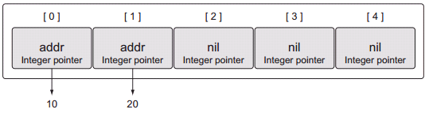
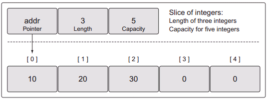
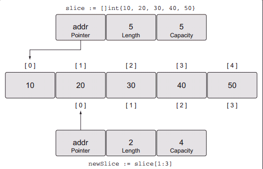
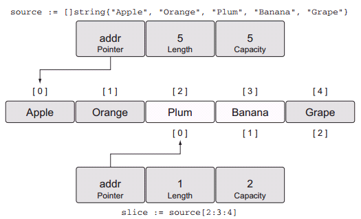
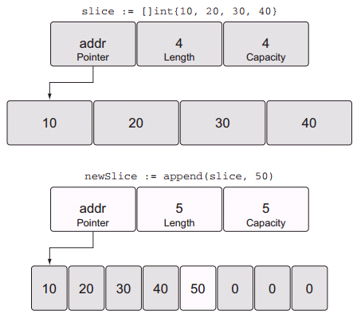

# Packaging and Tooling

## Package

1. 所有.go文件都需要声明一个package
2. package命名规则：short，concise，lowercase
3. 根目录下一定有个根文件 package main，这个根文件一定有个main()函数，这是整个程序的入口
4. package是程序代码模块的管理方式

## Import

1. import的package包现在go安装路径的标准库里找，再到配置的GOPATH路径下找，找不到报错

2. import格式：

   ```
   import{
       "fmt"
       "Strings"
   }
   ```

3. 支持远程import，如果import的是url，就会用go get从url获取源代码，放到GOPATH目录下

4. 支持named import，如果多个package含相同的包名，可以在import时取个不一样的名字

5. import的package必须被用到，如果没用到会报错。有些包没用到，但需要初始化，则可以在前面加_，就是用 _(空标识)命名一个包

   

## init函数

1. 用于初始化，一般被 _ import调用

   ```
   func init(){
       ...
   }
   ```

   

## 包依赖

godeps，vendor，gb

vendor：

自 1.5 版本开始引入 govendor 工具，该工具将项目依赖的外部包放到项目下的 vendor 目录下，并通过 vendor.json 文件来记录依赖包的版本，方便用户使用相对稳定的依赖。

对于 govendor 来说，主要存在三种位置的包：项目自身的包组织为本地（local）包；传统的存放在 $GOPATH 下的依赖包为外部（external）依赖包；被 govendor 管理的放在 vendor 目录下的依赖包则为 vendor 包。


# 数据类型

## Array

1. 同一类型元素组成的固定长度的连续块，每个块有0开始的索引
2. 一旦声明，类型和长度不可变，效率高（内存连续分配），查询速度快，插入变长度需要复制成新的数组成本高
3. 声明的时候未赋值，Array就初始化成每个元素为**0/nil**

```
var array [5]int
array:=[5]int{1,2,3,4,5}
array:=[...]int{1,2,3,4,5}
array := [5]int{1: 10, 2: 20}
  
```

   4. 数组元素为int的指针

      ```
      array := [5]*int{0: new(int), 1: new(int)}
      *array[0] = 10
      *array[1] = 20
      ```

      

   5. 数组是value类型，数组间的赋值其实是value copy

   6. 函数中传递数组是值传递，需要复制，如果数组很大消耗就很大，而且函数内对数组元素的修改出了函数就不影响了。传递指针效率高，而且函数内对数组的修改出了函数还有效

      ```
      var array [1e6]int
      foo(&array)
      func foo(array *[1e6]int) {
      ...
      }
      ```

      

## Slice

1. 动态数组，可伸缩

2. 底层操作的 还是定长数组，只是把实现伸缩的数组赋值隐藏起来了，**指针传递**

   

3. 初始化时[]为空为slice，[]有数字则是array。

   ```
   slice := make([]string, 5)
   slice := make([]int, 3, 5)
   slice := []string{"Red", "Blue", "Green", "Yellow", "Pink"}
   
   array := [3]int{10, 20, 30}
   slice := []int{10, 20, 30}
   ```

4. nil slice和empty slice的区别

5. slice赋值底层共享数组，共享数组元素改变同时受影响

   

   ​             默认capacity就是底层数组取值后的最长

   

   ​          确定capacity，不能大于底层数组的长度，不然会报错。

6. append操作，如果length<capacity，则新slice和旧slice共享数组，如果length=capacity，新slice则新建底层数组

   

   所以这时很复杂会搞不清什么时候是共享，什么时候是新建独立。所以为了安全起见，当append的数组原来是赋值过来的时候，赋值的时候要限定length=capacity，这样append的时候肯定会新建底层数组了。

7. 轮询slice，一种是用for（可以根据下标灵活控制），一种是用range（从头到底，返回index和元素）， range其实是把底层数组的每个元素都copy一份出来

   

## Map

1.  无序的key-value对集合

2. 初始化,key需要课比较的（==），slice/function/包含slice的struct不能做key，但slice可以做value

   ```
   dict := make(map[string]int)
   dict := map[string]string{"Red": "#da1337", "Orange": "#e95a22"}
   dict := map[int][]string{}
   ```

3. 初始化后才能赋值，只声明未初始化（nil）赋值会报错

4. 判断key是否存在

   ```
   value, exists := colors["Blue"]
   ```

5. Map和slice一样，是指针，函数传参是指针的复制，函数中对Map的修改会影响Map

   

## SUMMARY

- Arrays are the building blocks for both slices and maps.
- Slices are the idiomatic way in Go you work with collections of data. Maps are
  the way you work with key/value pairs of data.
- The built-in function **make** allows you to create slices and maps with initial
  length and capacity. Slice and map literals can be used as well and support setting initial values for use.
- Slices have a capacity restriction, but can be extended using the built-in function **append**.
- Maps don’t have a capacity or any restriction on growth.
- The built-in function **len** can be used to retrieve the length of a slice or map.
- The built-in function **cap** only works on slices.
- Through the use of composition, you can create multidimensional arrays and
  slices. You can also create maps with values that are slices and other maps. A
  slice can’t be used as a map key.
- Passing a slice or map to a function is cheap and doesn’t make a copy of the
  underlying data structure. 

# Go's Type System

Go是个静态语言，编译器要预先知道值的类型，这样才能分配好内存，也安全减少了bug

有两种类型：built-in type, user defined type

ar a int  当你声明一个变量时，已经初始化为zero值，

a:=3 声明+赋值初始化

## 用户定义的type

有两种方法：

1. 通过struct定义复合类型，类似于java的class，struct和嵌struct

   当你声明一个struct变量时，各字段初始为zero值

2. 把已有类型重命名当新类型用，这是两种不同的类型，不能互相赋值

   type Duration int64 

## method

有receiver的func叫做method，可以通过receiver直接调用，但不像java的method写在class里面。 

func  （receiver） funcname(params) (return)

receiver可以是值也可以是指针， 调用时receiver可以是值也可以是指针，编译器会做适配。 区别在于值是copy的调用完方法值是不变的，指针的话调用完方法仍然有效

## The nature of types

Does adding or removing something from a value of this type need to create a new value or mutate the existing one? If the answer is create a new value, then use
value receivers for your methods. If the answer is mutate the value, then use pointer receivers.  

### Built-in type

primitive nature: when adding or removing something from a value of one of these types, a new value should be created. Based on this, when passing values of these
types to functions and methods, a copy of the value should be passed. 

value receiver for method

### Reference type

slice,map,channel,interface,function

contain a pointer to an underlying data structure 

value receiver for method

### Struct type

either a primitive or nonprimitive nature.  

When the decision is made that a struct type value should not be mutated when something needs to be added or removed from the value, then it should follow the guidelines for the built-in and reference types.  

In most cases, struct types don’t exhibit a primitive nature, but a nonprimitive one. In these cases, adding or removing something from the value of the type should mutate the value. When this is the case, you want to use a pointer to share the value with the rest of the program that needs it 


The decision to use a value or pointer receiver should not be based on whether the method is mutating the receiving value. The decision should be based on the nature of the type. One exception to this guideline is when you need the flexibility that value type receivers provide when working with interface values. In these cases, you may choose to use a value receiver even though the nature of the type is nonprimitive. 


## Interface

定义一个interface，含空函数

只要实现了interface的函数，并且有receiver的，就可以把receiver赋值给interfce，直接通过interface调用方法来实现多态

receiver可以是值，也可以是指针

当receiver是值时，可以把值和指针都赋值给interface来调用方法；如果receiver是指针时，只有指针可赋值给interface来调用方法。因为不一定能取到值的地址，所以不能把值赋值给指针类型的receiver。


## Type embedding

struct 内可以嵌struct， 如果内层struct默认会得到提升，可以直接通过外层struct调用内层struct的方法。 如果内层struct实现了interface，默认提升后，可以把外层struct赋值给interface。

如果要去掉这种默认提升，需要外层明确实现相同的方法（包括interface的方法）


## 暴露

首字符大写的字段和方法才能暴露到package外，package外才能调用到。

首字母小写的字段可以通过暴露的方法把值传给外面， 外面通过v:= 获取到

First, identifiers are exported or unexported, not values. Second, the short variable declaration operator is capable of inferring the type and creating a variable of the unexported type.  

如果内层Struct不暴露，可以通过 type embeding自动提升，可以通过外层Struct直接访问内层struct的字段


## Summary

1. User-defined types can be declared using the keyword struct or by specifying an existing type.
2. Methods provide a way to add behavior to user-defined types.
3. Think of types as having one of two natures, primitive or non-primitive.
4. Interfaces are types that declare behavior and provide polymorphism.
5. Type embedding provides the ability to extend types without the need for inheritance.
6. Identifiers are either exported or unexported from packages. 