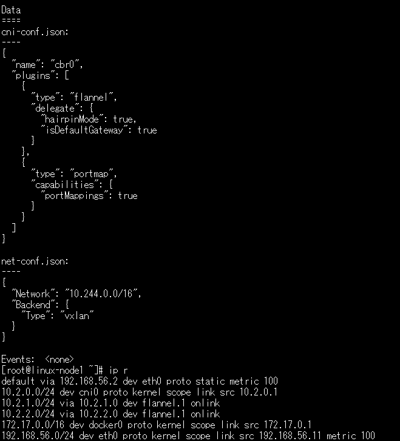
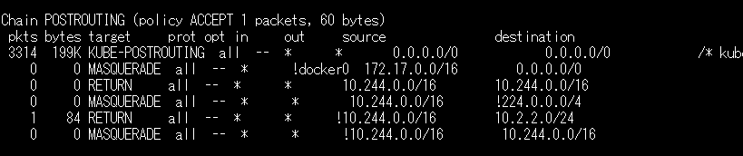
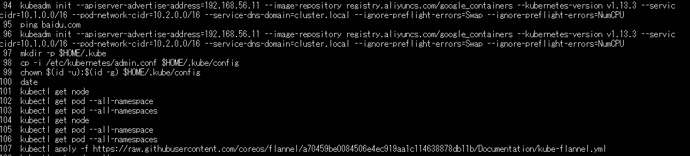
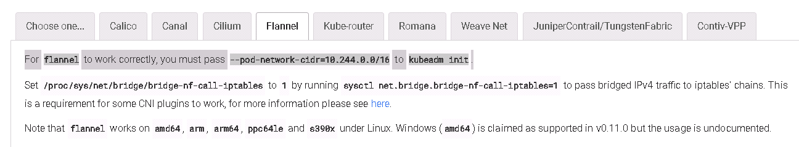
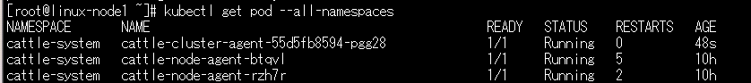
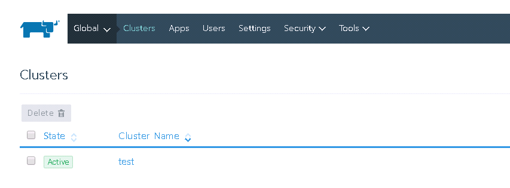

# 事件起因

公司kubernetes和docker的一次培训课，培训老师已经在三台虚拟机上预装了kubernetes环境，在上面安装ancher的时候发现一个pod不停重启，无法正常启动。


# 排查过程

首先查看pod不停重启，无法正常启动的原因

kubectl logs <podname> -n cattle-system

发现pod是无法连接到rancher的docker容器（暴露在node1宿主机的443端口下）


查看rancher的docker容器是否暴露在node1的443端口下

netstat -tunlp|grep 443

发现宿node1主机443端口正常开启，也能telnet进去

说明server端没有问题，client连不上去


进入node2和node3的pod，发现访问不了其它的node，只能访问本机，怀疑网络组件（flannel）有问题

进一步查看flannel pod




发现pod的网络是在10.2网段，而flannel的分配网段在10.244网段，不一致。


网上查了资料flannel进出网络跟iptables的 postrouting nat规则有关，查了一下发现规则果然按照10.244生成的




搜了一下kubernetes环境搭建的命令记录



发现用kubeadm init新建集群的时候设定了pod ip段 --pod-network-cidr=10.2.0.0/16，而建flannel组件的yaml文件里规定的pod-network-cidr是10.244.0.0/16。


flannel还特意备注，为了使flannel生效，需要kubeadm init的时候把pod 地址段设成10.244.0.0/16。至此，终于找到问题。




# 解决办法

在目前集群已建好的情况下，pod ip段已经固定为10.2.0.0，只有重建flannel匹配它。

```
wget https://raw.githubusercontent.com/coreos/flannel/a70459be0084506e4ec919aa1c114638878db11b/Documentation/kube-flannel.yml
kubectl delete -f kube-flannel.yml 
vim kube-flannel.yml   修改IP地址段为 10.2.0.0/16
kubectl create -f kube-flannel.yml
```

重建flannel之后，rancher pod正常启动了



rancher也纳管kubernetes集群成功了



